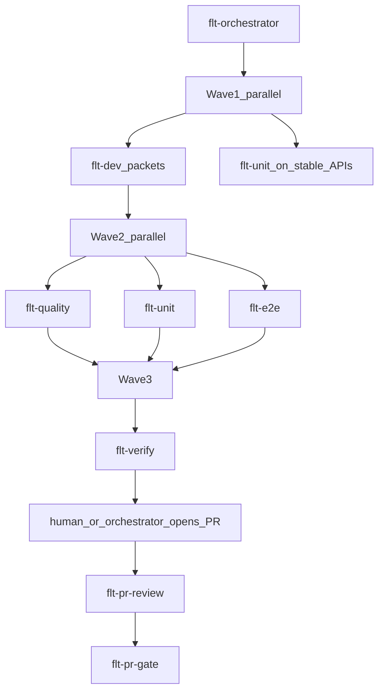

# Agentic Council — Orchestrator Map (RESTRICTED)

**Status:** accepted for project process  
**Date:** 2026-08-02  
**Audience:** human + orchestrator agent only  

## Isolation law

1. Worker agents receive a **sealed task packet** only: goal, file paths, acceptance criteria, constraints, output format.
2. Worker prompts and `.cursor/agents/*` files **must not** name other workers, describe the pipeline, or explain who consumes their output.
3. The orchestrator **never** pastes this document (or the roster below) into a worker context.
4. Workers that ask “who else is working?” get: “Complete your sealed packet. Out of scope.”

## Ponytail + skill catalog

All implementation and review that touches code must apply skill **ponytail** at intensity **full** (lazy senior: YAGNI, stdlib first, shortest correct diff). Quality means clear, minimal, maintainable — not clever architecture.

Project skills for UI / domain / SQLite live under `.agents/skills/`. Full map and packet hints: [docs/skills.md](../../skills.md). Orchestrator injects skill **names** into sealed packets; never dump this roster into worker context.

## Roster (orchestrator only)

| Agent file | Role (orchestrator label) | Mutates repo? |
|------------|---------------------------|---------------|
| `flt-orchestrator.md` | Plans waves, dispatches sealed packets, merges results, owns parallelism | yes (docs/process only unless filling gaps) |
| `flt-dev.md` | Implements product code per packet | yes |
| `flt-quality.md` | Code quality review; findings + required fixes list | readonly preferred |
| `flt-unit.md` | Unit tests for assigned units | yes (tests) |
| `flt-e2e.md` | E2E / smoke desktop flows | yes (e2e harness) |
| `flt-verify.md` | Verification gate: commands, evidence, pass/fail | readonly |
| `flt-pr-review.md` | PR review comments (no merge decision) | readonly |
| `flt-pr-gate.md` | Approve or deny PR with rationale | readonly (uses `gh`) |

## Parallel waves (typical feature)



**Parallelism rules**

- Split independent vertical slices (e.g. `piToClass` + time utils vs SQLite seed vs UI shell) into separate `flt-dev` packets.
- `flt-unit` may start on pure domain modules as soon as their public API is specified in the packet (TDD) even before UI exists.
- `flt-quality`, `flt-unit` (integration parts), and `flt-e2e` run in parallel after a slice is marked “code complete” by orchestrator — each gets the same diff/paths, not each other’s reports.
- `flt-verify` runs only after wave-2 agents return; it gets **artifacts** (commands to run, paths), not other agents’ narratives.
- PR agents run only on an open PR; `flt-pr-review` then `flt-pr-gate` sequentially (gate must not see reviewer’s private chain-of-thought — only the PR + checklist evidence).

## Sealed task packet template

```markdown
# Task packet
## Goal
## In scope paths
## Out of scope
## Constraints
- ponytail full
- local-only app; no sync/share
## Acceptance criteria
## Deliverable format
```

## Failure handling

- Any worker **FAIL** → orchestrator opens a new sealed fix packet to `flt-dev` (or the owning writer). Do not CC other roles.
- `flt-pr-gate` **DENY** → orchestrator creates fix packets from the gate’s written reasons only.

## What workers must never receive

- This file’s roster or diagrams
- Names/descriptions of sibling agents
- Another worker’s full report (summarize into neutral acceptance gaps if a fix is needed: “Missing unit test for PI=0 → D”)
